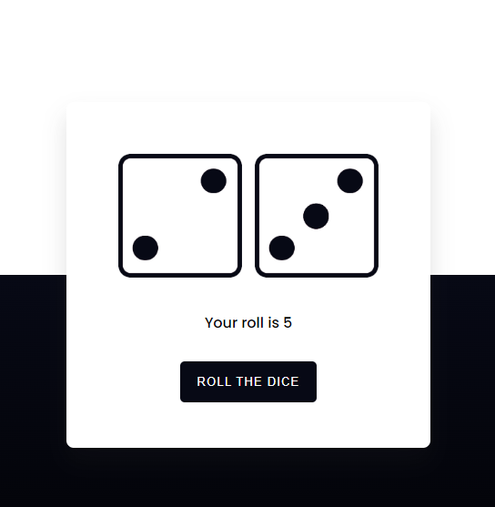

# Roll The Dice Web App

This is a simple web application that allows users to simulate rolling a pair of dice. The application displays two dice images, and when the "ROLL THE DICE" button is clicked, the dice images are animated with a shaking effect, and then the values of the rolled dice are displayed along with their sum. The project is built using HTML, CSS, and JavaScript.



## Demo

Check out the live demo of the Roll The Dice web app: [Demo](https://arindal1.github.io/Dice-Game/)

## Features

- Simulates rolling a pair of dice with a realistic animation.
- Displays the values of the rolled dice and their sum.
- Responsive design for a seamless experience across devices.

## Installation

1. Clone the repository to your local machine:

   ```bash
   git clone https://github.com/arindal1/Dice-Game.git
   ```

2. Navigate to the project directory:

   ```bash
   cd roll-the-dice
   ```

## Usage

1. Open the `index.html` file in a web browser to use the Roll The Dice web app.
2. Click the "ROLL THE DICE" button to simulate rolling the dice.
3. The dice images will shake with an animation, and the values of the rolled dice will be displayed below the dice images.

## Technologies Used

- HTML: Defines the structure of the web page.
- CSS: Styles the appearance of the web page and creates the animation effect.
- JavaScript: Adds interactivity by handling dice rolling and displaying results.
- Google Fonts: Provides the "Poppins" font for the text styling.

## The Code

The application allows users to click a button to roll two dice, and the values of the dice are displayed along with their sum.
Here's a breakdown of how your code works:

**HTML:**
- The HTML file defines the structure of the web page.
- It includes references to external resources such as Google Fonts, CSS, and JavaScript files.
- Inside the `<body>` element, there's a container `<div>` that holds the dice, a paragraph for displaying the total roll value, and a button to roll the dice.
- There's also a footer `<div>` displaying copyright information.

**CSS:**
- The CSS file defines the styling of the web page.
- It sets global styles such as removing padding and margin, and applying the box-sizing.
- The background is a linear gradient that gives a visual effect to the page.
- The `.container` class defines the styling of the central content area, including the dice and the roll button.
- The `.dice-wrapper` class styles the dice display area.
- The `.shake` class is used for applying a shaking animation to the dice.

**JavaScript:**
- The JavaScript file defines the logic for rolling the dice.
- An array named `images` contains the filenames of dice images.
- The `dice` variable holds references to the two dice images on the page.
- The `roll()` function is triggered when the "ROLL THE DICE" button is clicked.
- Inside the `roll()` function:
  - The `.shake` class is added to both dice images to trigger the shaking animation.
  - After a short timeout (1 second), the `.shake` class is removed, stopping the shaking animation.
  - Two random values are generated for the dice rolls (values from 0 to 5).
  - The source of each dice image is updated with a random dice face.
  - The sum of the dice values is calculated and displayed in the `#total` paragraph.

Overall, this code creates a visually appealing and interactive web page where users can simulate rolling a pair of dice and see the result. The code effectively combines HTML for structure, CSS for styling, and JavaScript for interactivity to create a complete web application.

## Contributing

Contributions are welcome! If you have any suggestions or improvements, please create an issue or submit a pull request. Here's how you can contribute:

1. Fork the repository.
2. Create a new branch for your feature or improvement.
3. Make your changes and test them.
4. Commit your changes and push them to your fork.
5. Open a pull request, describing the changes you've made.

## Contact

If you have any questions, suggestions, or just want to connect, feel free to reach out:

- GitHub: [arindal1](https://github.com/arindal1)
- LinkedIn: [Arindal](https://www.linkedin.com/in/arindalchar/)

---

**Disclaimer:** This project was created for educational purposes and to showcase web development skills. The dice images used in this project are for illustrative purposes and were made by me on Photoshop.

### Happy coding! 🚀
